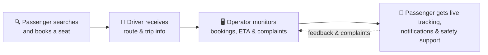
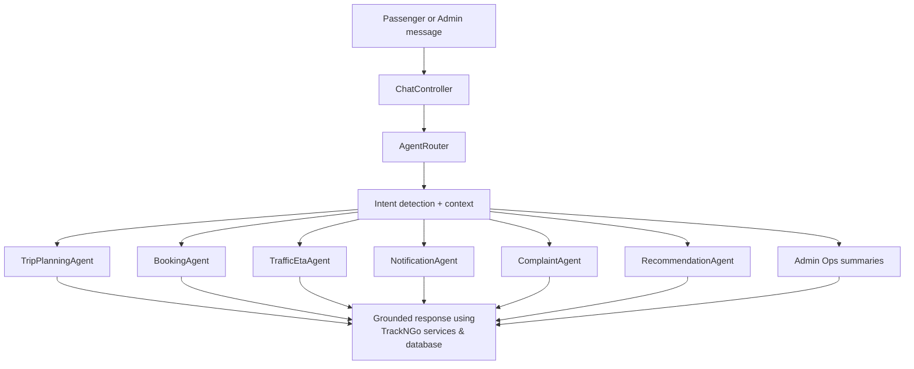
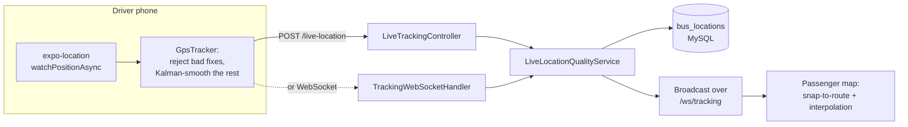
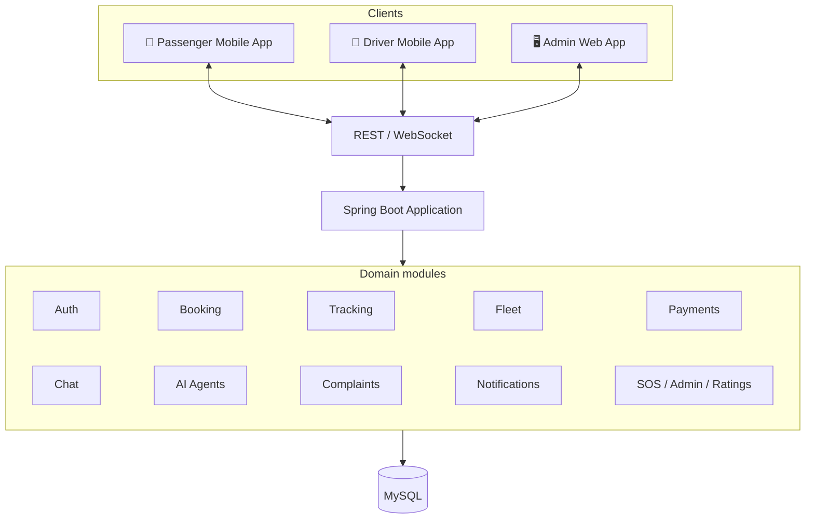

<div align="center">


# TrackNGo

**A connected, AI-assisted transport management platform for passengers, drivers, operators, and corporate transport teams.**

[](backend/trackngo-backend)
[](backend/trackngo-backend)
[](frontend)
[](frontend)
[](frontend/admin-web/my-react-app)
[](frontend)
[](trackngo_complete.sql)
[](#license)

<br/>

[](frontend/admin-web/my-react-app)
[](frontend/admin-web/my-react-app)
[](backend/trackngo-backend/tracking-module)
[](backend/trackngo-backend/auth-user-module)
[](https://mapsplatform.google.com/)
[](backend/trackngo-backend/ai-agent-module)
[](backend/trackngo-backend/payment-module)
[](backend/trackngo-backend/sos-module)
[](backend/trackngo-backend/pom.xml)
[](frontend)

</div>

<br/>

TrackNGo brings the complete public and corporate transport journey into one ecosystem — route discovery, seat booking, payments, digital tickets, live bus tracking, driver operations, real-time communication, complaints, emergency support, and administrator analytics — powered by a modular Spring Boot backend and a purpose-built AI assistant.

<div align="center">

| 📱 Passenger App | 🚌 Driver App | 🖥️ Admin Dashboard |
|:---:|:---:|:---:|
| Search, book, pay, track live, chat, get AI help, and raise SOS alerts | Manage allocations, share live location, view earnings, and chat | Manage fleet, routes, bookings, complaints, and run AI-assisted operations |

</div>

## 📚 Table of contents

- [Why TrackNGo?](#-why-trackngo)
- [Feature highlights](#-feature-highlights)
- [AI assistant and agent architecture](#-ai-assistant-and-agent-architecture)
- [Live tracking pipeline](#-live-tracking-pipeline)
- [Architecture](#-architecture)
- [Technology stack](#-technology-stack)
- [Repository structure](#-repository-structure)
- [Getting started](#-getting-started)
- [Configuration](#-configuration)
- [Database setup](#-database-setup)
- [Running the project](#-running-the-project)
- [Testing](#-testing)
- [Demo flow](#-suggested-demonstration-flow)
- [Limitations & roadmap](#-current-limitations-and-production-considerations)
- [License](#-license)

## 🎯 Why TrackNGo?

Transport information is often fragmented: passengers don't know whether a bus is available or delayed, drivers lack operational communication tools, and administrators juggle bookings, fleet data, complaints, and emergencies across disconnected workflows.

TrackNGo connects the entire journey end to end:



## ✨ Feature highlights

<table>
<tr><td valign="top" width="33%">

### 📱 Passenger

- Registration, login, OTP verification
- Route/bus search by origin, destination, date
- Seat selection & booking confirmation
- Stripe & PayHere payment flows
- Digital tickets with QR codes
- Booking history, cancellation & refunds
- **Live bus tracking** with route geometry
- Real-time chat & notifications
- **AI assistant** for routes, ETA, bookings, complaints
- SOS alerts & emergency contacts
- Corporate transport contracts & billing

</td><td valign="top" width="33%">

### 🚌 Driver

- Driver authentication & profile
- Assigned trip & route views
- **Live GPS location sharing**
- Seat & allocation information
- Earnings dashboard
- Notifications & real-time chat

</td><td valign="top" width="33%">

### 🖥️ Administrator

- Operational analytics dashboard
- User, driver & corporate management
- Fleet, seat layout & route management
- Booking & payment status control
- Complaint review & resolution
- SOS & emergency handling
- Promotions & discounts
- Corporate contracts & invoicing
- **AI operations assistant**

</td></tr>
</table>

## 🤖 AI assistant and agent architecture

TrackNGo ships a unified conversational assistant available in both the passenger app and the admin dashboard, backed by a Spring AI-compatible orchestration layer and six specialized domain agents.

| Agent | Responsibility |
|---|---|
| 🗺️ `TripPlanningAgent` | Finds available routes and bus options between two locations for a date, category, and preferred time. |
| 🎟️ `BookingAgent` | Handles seat reservations and returns booking status, reference, seats, and fare details. |
| ⏱️ `TrafficEtaAgent` | Uses live bus location and traffic context to report current position, delay, ETA, and confidence. |
| 🔔 `NotificationAgent` | Sends or prepares ride reminders, delay alerts, and alternative-route notifications. |
| 📋 `ComplaintAgent` | Categorizes, summarizes, prioritizes, and routes complaints to the right workflow. |
| 💡 `RecommendationAgent` | Produces travel, promotion, and service recommendations from user and trip context. |



The assistant is designed to be **action-oriented rather than a generic chatbot**:

- ✅ Uses authenticated passenger context where available
- ✅ Grounds route and booking answers in real TrackNGo data
- ✅ Checks bus and seat availability before creating a booking
- ✅ Requires explicit confirmation before completing booking actions
- ✅ Never invents booking references or payment confirmations
- ✅ Triages safety-related complaints into the admin review workflow
- ✅ Falls back to a deterministic response if the external AI provider is unavailable
- ✅ Keeps session conversation context using a chat ID

<details>
<summary><b>💬 Example prompts</b></summary>

**Passenger**
```text
Find buses from Colombo Fort to Kandy tomorrow morning
ETA for NB-0012
Book one seat from Colombo Fort to Galle
What should I do if my bus is late?
I want to report an unsafe driving incident for booking BK-20250501-ABCD
```

**Administrator**
```text
Give me today's operations summary
Show unresolved high-priority complaints
Which buses are linked to recent safety complaints?
What promotions should we run for frequent passengers?
Send a delay notification to passengers on this route
```

</details>

See [AI_ASSISTANT_GUIDE.md](AI_ASSISTANT_GUIDE.md) for implementation and testing notes.

## 📍 Live tracking pipeline

A raw GPS stream from a driver's phone is noisy — accuracy jumps, cold-start fixes, and out-of-order packets can all make a bus marker teleport across the map. TrackNGo runs every fix through a shared quality pipeline on **both** the driver app and the server before it ever reaches a passenger:



- **Rejects** implausible fixes: accuracy worse than 100 m, `(0,0)` "no fix" readings, out-of-order timestamps, and jumps implying more than 45 m/s (162 km/h)
- **Kalman-smooths** the position with process noise that adapts to the bus's own apparent speed — heavy smoothing while parked, almost none at speed
- **Snaps to route** when the fix is close enough to be confidently on the road, without hiding a genuine diversion
- **Scores confidence** 0–100 on a log scale of GPS accuracy, decaying as a fix ages, so the rider always knows how much to trust the dot
- Identical scoring logic is implemented in **TypeScript** (driver/passenger apps) and **Java** (server) so the badge never disagrees with itself

## 🏗️ Architecture

TrackNGo is a **modular monolith**: business domains are separated into independent Maven modules, deployed as a single Spring Boot service.



### Backend modules

`backend/trackngo-backend` currently contains:

| Module | Responsibility |
|---|---|
| `commons` | Shared models, utilities, and common backend functionality |
| `auth-user-module` | Authentication, authorization, users, roles, passengers, drivers, corporate users |
| `booking-module` | Route search, trip booking, seat booking, cancellation, refunds |
| `tracking-module` | Bus location and live tracking support |
| `driver-fleet-module` | Buses, fleet operations, seat layouts |
| `driver-module` | Driver-specific functionality |
| `payment-module` | Payment services and transaction workflows |
| `notification-module` | Notifications and alerts |
| `complaint-module` | Complaints, categorization, status, priority, resolution |
| `chat-module` | Real-time conversations, messages, media, delivery status, presence |
| `feedback-rating-module` | Passenger ratings and feedback |
| `admin-module` | Administrator operations and audit logging |
| `sos-module` | SOS alerts and emergency support |
| `ai-agent-module` | AI controller, intent routing, six agents, grounding, conversation memory |
| `app` | Main Spring Boot application and configuration |

## 🧰 Technology stack

<table>
<tr><td valign="top" width="50%">

**Backend**


- Spring Web / REST APIs
- Spring WebSocket + STOMP/SockJS
- Spring AI-compatible chat integration
- Bean Validation, Lombok

**AI**


- Configurable primary + fallback models
- Function/tool-oriented agent services
- Conversation memory & TrackNGo data grounding

</td><td valign="top" width="50%">

**Passenger & driver apps**


- Expo Router, Expo Location
- React Native Maps
- STOMP.js + SockJS for live tracking/chat
- QR code generation
- Expo Print, Sharing, Media Library, WebView

**Admin dashboard**


- TypeScript, React Router
- Font Awesome
- Jest + Testing Library

**Data & integrations**


- PayHere for local payment flow support

</td></tr>
</table>

## 📂 Repository structure

```text
TrackNGo/
├── backend/
│   └── trackngo-backend/
│       ├── commons/
│       ├── auth-user-module/
│       ├── booking-module/
│       ├── tracking-module/
│       ├── driver-fleet-module/
│       ├── driver-module/
│       ├── payment-module/
│       ├── notification-module/
│       ├── complaint-module/
│       ├── chat-module/
│       ├── feedback-rating-module/
│       ├── admin-module/
│       ├── sos-module/
│       ├── ai-agent-module/
│       └── app/
├── frontend/
│   ├── mobile-app/TrackNgo-Mobile/   # Passenger application
│   ├── driverapp/                    # Driver application
│   └── admin-web/my-react-app/       # Administrator dashboard
├── postman/
├── .postman/
├── trackngo_complete.sql   # Schema only — no sample/seed data is committed
├── AI_ASSISTANT_GUIDE.md
└── README.md
```

## 🚀 Getting started

### Prerequisites

| Requirement | Notes |
|---|---|
| ☕ Java 21 | Backend runtime |
| 📦 Maven | Backend build |
| 🐬 MySQL 8+ | Or a compatible MySQL server |
| 🟩 Node.js & npm | Frontend apps |
| 📱 Android Studio / Expo | For mobile development and emulation |
| 🔑 API credentials | For the integrations you want to enable (Maps, AI, Stripe, PayHere, Twilio) |

## ⚙️ Configuration

Copy `.env.example` to `.env` in the repository root and update the values.

<details>
<summary><b>Core configuration</b></summary>

```env
DB_URL=jdbc:mysql://localhost:3306/trackngo?useSSL=false&allowPublicKeyRetrieval=true&serverTimezone=UTC
DB_USERNAME=root
DB_PASSWORD=your_db_password
JWT_SECRET=your-jwt-secret-at-least-32-characters-long
GOOGLE_MAPS_API_KEY=your_google_maps_api_key
```

</details>

<details>
<summary><b>SMS configuration</b></summary>

```env
TWILIO_ACCOUNT_SID=your_twilio_account_sid
TWILIO_AUTH_TOKEN=your_twilio_auth_token
TWILIO_PHONE_NUMBER=your_twilio_phone_number
TWILIO_MESSAGING_SERVICE_SID=your_twilio_messaging_service_sid
TWILIO_DEFAULT_COUNTRY_CODE=+94
SMS_PROVIDER=twilio
```

An Android SMS gateway is also supported through `SMS_ANDROID_GATEWAY_URL` and `SMS_ANDROID_GATEWAY_API_KEY`.

</details>

<details>
<summary><b>Payments configuration</b></summary>

```env
STRIPE_SECRET_KEY=sk_test_your_stripe_secret_key
STRIPE_PUBLISHABLE_KEY=pk_test_your_stripe_publishable_key
PAYHERE_MERCHANT_ID=your_payhere_merchant_id
PAYHERE_MERCHANT_SECRET=your_payhere_merchant_secret
PAYHERE_SANDBOX=true
```

</details>

<details>
<summary><b>AI configuration</b></summary>

The backend supports OpenAI-compatible providers and Gemini-compatible endpoints:

```env
AI_API_KEY=your_ai_provider_api_key
AI_BASE_URL=https://api.groq.com/openai/v1
AI_MODEL=llama-3.1-8b-instant
AI_FALLBACK_MODEL=llama-3.1-8b-instant
AI_MODEL_TIMEOUT_SECONDS=12
AI_MODEL_FUNCTIONS_ENABLED=false
AI_MODEL_DIRECT_HTTP_ENABLED=true
```

Gemini-style fallback names are also supported:

```env
GEMINI_API_KEY=your_gemini_api_key
GEMINI_MODEL=gemini-1.5-pro
GEMINI_FALLBACK_MODEL=gemini-1.5-flash
```

</details>

> ⚠️ **Never commit real credentials.** Use test/sandbox credentials for development and demonstrations.

## 🗄️ Database setup

```sql
CREATE DATABASE trackngo;
```

```bash
# Full schema
mysql -u root -p trackngo < trackngo_complete.sql
```

> 🔒 **Sample/demo data is intentionally not committed to this repository.** A seed dump is convenient for local demos, but a file where every fabricated account shares one bcrypt hash for the same publicly-documented password is safe only as long as nobody ever loads it onto anything internet-reachable — a mistake that is easy to make and hard to notice. If you need demo data locally, generate your own seed with unique, randomly-salted passwords per account and keep it out of version control — `trackngo_sample_data.sql` is already covered by `.gitignore`.

For current, data-backed driver earnings in the demonstration app, run the idempotent development seed after populating some passengers, drivers, and buses:

```bash
mysql -u root -p trackngo < backend/trackngo-backend/database/seed/dev_driver_earnings.sql
```

This creates linked completed bookings and successful payments for assigned drivers. The driver app calculates monthly earnings, weekly earnings, growth, and the earnings list from those records.

<details>
<summary><b>Production migrations (run before deploying an existing database)</b></summary>

- Run the **seat-booking concurrency migration** in `backend/trackngo-backend/database/migrations` before deploying the new backend build. It backfills the seat-level reservation index and adds the database unique constraint that prevents two users from owning the same seat for the same bus and date. Follow that directory's runbook and take a backup first.
- Run `V3__booking_disruption_refunds.sql` before enabling route or bus removal/maintenance workflows. These workflows preserve route and bus rows, cancel future confirmed bookings, notify passengers, and create idempotent refund requests. Stripe refunds are processed automatically when a PaymentIntent ID is available; other providers remain pending until their refund adapter is configured.
- Run `V4__booking_restoration_notifications.sql` before deploying the workflow that notifies passengers when a repaired bus or route becomes active again.
- Run `V5__bus_disruption_database_guard.sql` last. It provides a database-level guard for bus maintenance changes made by any admin client and repairs previously missed cancellations.

</details>

The backend runs with `spring.jpa.hibernate.ddl-auto=validate` by default (see `JPA_DDL_AUTO` in `.env.example`), so Hibernate checks the schema against the entities rather than creating it — `trackngo_complete.sql` is what actually creates the tables on a fresh database.

## ▶️ Running the project

### 1️⃣ Backend

```bash
cd backend/trackngo-backend
# Stop any previously running app process before cleaning the jar.
mvn -pl app -am clean package -DskipTests
java -jar app/target/app-1.0.0-SNAPSHOT.jar
```

> The `-am` flag builds dependent modules from the current source tree, and the jar command runs the `app` module explicitly — this avoids the parent project being selected as the Spring Boot application and prevents running a stale copy of a module.

Runs on **`http://localhost:8080`**

### 2️⃣ Passenger mobile app

```bash
cd frontend/mobile-app/TrackNgo-Mobile
npm install
npx expo install --fix
npm start
```

The app detects the Expo development host automatically and uses port `8080` for the backend by default. Override with:

```env
EXPO_PUBLIC_API_BASE_URL=http://YOUR_BACKEND_HOST:8080
```

For an Android emulator, use the host address reachable from the emulator — commonly `http://10.0.2.2:8080`.

### 3️⃣ Driver app

```bash
cd frontend/driverapp
npm install
npx expo start
```

Optional configuration in `frontend/driverapp/.env.example`:

```env
EXPO_PUBLIC_API_BASE_URL=http://YOUR_BACKEND_HOST:8080
EXPO_PUBLIC_GOOGLE_MAPS_API_KEY=your_google_maps_api_key
```

### 4️⃣ Administrator web app

```bash
cd frontend/admin-web/my-react-app
npm install
npm run dev
```

```bash
npm run build       # production build
npm run typecheck   # type checking
npm test            # test suite
```

## 🧪 Testing

```bash
# Backend — full suite across all Maven modules
cd backend/trackngo-backend
mvn test
```

```bash
# Admin dashboard
cd frontend/admin-web/my-react-app
npm run typecheck && npm test
```

```bash
# Passenger app
cd frontend/mobile-app/TrackNgo-Mobile
npm run typecheck && npm test
```

```bash
# Driver app
cd frontend/driverapp
npm test
```

Postman collections and additional testing notes are available in `postman/`, `.postman/`, and the project testing guides ([TEST_QUICK_START.md](TEST_QUICK_START.md), [UNIT_TESTING_GUIDE.md](UNIT_TESTING_GUIDE.md), [TEST_RESULTS_GUIDE.md](TEST_RESULTS_GUIDE.md), [LIVE_TRACKING_TESTING.md](LIVE_TRACKING_TESTING.md)).

## 🎬 Suggested demonstration flow

For a five-minute demo, tell one connected passenger-to-operator story:

1. 🔎 In the passenger app, ask **TrackNGo AI** to find buses from Colombo Fort to Kandy tomorrow morning.
2. 🎟️ Show route options, availability, seat selection, and a digital booking confirmation.
3. 📍 Open live tracking — show the route, bus location, ETA, and SOS entry point.
4. 🖥️ Switch to the administrator dashboard and ask the AI operations assistant for today's summary or unresolved high-priority complaints.
5. ✅ Open the relevant admin view to show the AI response is connected to real operational data.

The strongest message: TrackNGo is **not only a booking app** and **not only a chatbot** — it's an action-oriented transport platform connecting passengers, drivers, and operators through real booking, route, tracking, complaint, and notification services.

## ⚠️ Current limitations and production considerations

- AI features require a configured external model provider and API key
- Live ETA quality depends on the availability and freshness of GPS/location data
- Stripe, PayHere, Twilio, and Google Maps should be configured with production credentials before deployment
- Payment integrations should remain in sandbox/test mode during development and demonstrations
- AI responses should be rate-limited, monitored, and audited before production use
- Chat, location, payment, and emergency data require appropriate privacy and access controls
- The project is currently intended for educational, prototyping, and ideathon use

## 🔭 Future enhancements

- AI-powered ETA prediction using historical traffic and trip data
- Smarter route and fleet optimization
- Push notifications and broader device support
- Voice-enabled and multilingual passenger assistance
- Advanced operator analytics and forecasting
- QR validation and conductor/inspector workflows
- Cloud deployment, CI/CD, observability, and production-grade audit controls

## 📌 Project status

TrackNGo is an actively developed software engineering project with implemented passenger, driver, administrator, backend, real-time communication, payment, safety, and AI-agent workflows. Individual integrations may require local configuration, valid credentials, sample data, and an available backend service before they can be demonstrated end to end.

## 📄 License

This repository is intended for educational and academic purposes.

---

<div align="center">

Made with 🚌 by the TrackNGo team

</div>
